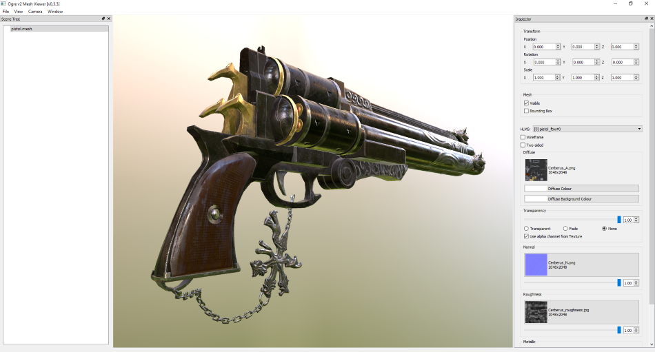

# Ogre3D mesh viewer/converter

A Ogre3D mesh viewer based on v2.1 which can import obj/gltf models.

 [Download](https://github.com/chchwy/ogre-v2-mesh-viewer/releases)

## How to compile

1. Have Qt 5 SDK installed (recommend Qt 5.6+), download it [here][0].
2. Have a working Ogre3D 2.1 sdk.
3. Set the path to Ogre sdk folder. You can either set an user-level `OGREHOME` environment variable, or set it directly in `ogre-v2-mesh-viewer.pro` line 9.
4. Open `ogre-v2-mesh-viewer.pro` in QtCreator and presse `RUN`.

[0]: https://www.qt.io/download-qt-installer "Qt download"

## TODO

- [ ] HLMS material editing (WIP)
- [ ] Batch convertor from mesh to obj
- [ ] glTF export
- [ ] Support DotScene
- [ ] Lighting
- [ ] HDR
- [ ] SSAO
- [x] Improve performance by converting obj data to ogre mesh directly
- [x] Automatically generate normals if there are no normal vectors in obj
- [x] glTF import

## Known issues

- [ ] Normals are broken when converting a v2-mesh to a obj
- [ ] Normal textures are not showing correctly on the material panel
- [ ] Normal weight doesn't update right after updating the Pbs blocks
- [ ] Metallic texture is not showing with DirectX11 rendersystem

## Acknowledgements

- Ogre3D: <https://www.ogre3d.org/>
- Qt: <https://www.qt.io/>
- Magus Toolkit: <https://github.com/spookyboo/Magus>
- tinyobjloader: <https://github.com/syoyo/tinyobjloader>
- Ogre glTF: <https://github.com/Ybalrid/Ogre_glTF>
- tinygltf: <https://github.com/syoyo/tinygltf>
- PBR Pistol: <http://artisaverb.info/PBT.html>
